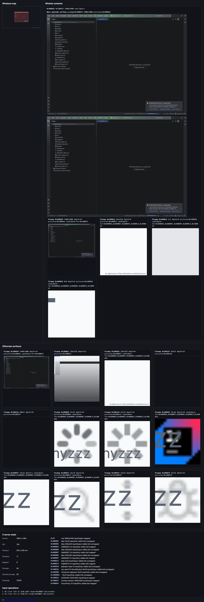
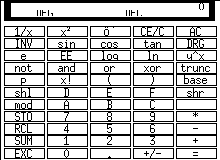
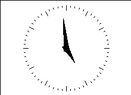
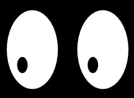
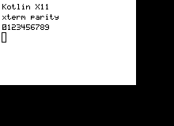
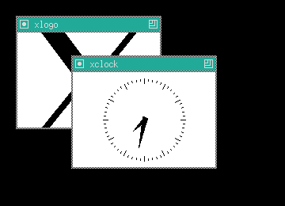
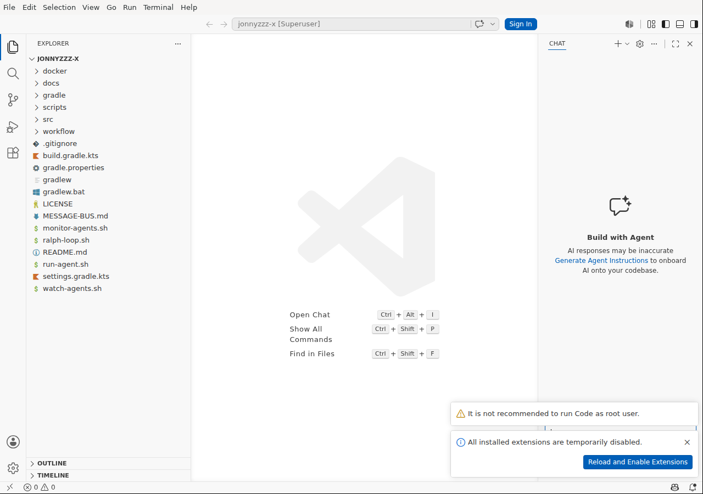
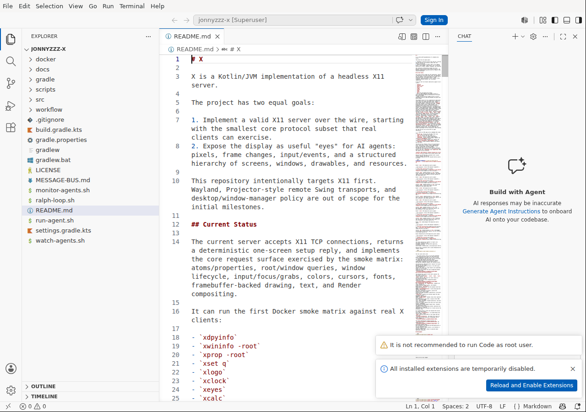

# X

X is a Kotlin/JVM implementation of a headless X11 server.

The project has two equal goals:

1. Implement a valid X11 server over the wire, starting with the smallest core protocol subset that real clients can exercise.
2. Expose the display as useful "eyes" for AI agents: pixels, frame changes, input/events, and a structured hierarchy of screens, windows, drawables, and resources.

This repository intentionally targets X11 first. Wayland, Projector-style remote Swing transports, and desktop/window-manager policy are out of scope for the initial milestones.

## Current Status

The current server accepts X11 TCP connections, returns a deterministic one-screen setup reply, and implements the core request surface exercised by the smoke matrix: atoms/properties, root/window queries, window lifecycle, input/focus/grabs, colors, cursors, fonts, framebuffer-backed drawing, text, and Render compositing.

It can run the first Docker smoke matrix against real X clients:

- `xdpyinfo`
- `xwininfo -root`
- `xprop -root`
- `xset q`
- `xlogo`
- `xclock`
- `xeyes`
- `xcalc`
- `xterm`
- `twm` with overlapping app windows
- IntelliJ IDEA Community from GitHub releases in opt-in heavyweight smoke and deterministic full-pixel Xvfb parity probes
- VSCode from the official update service in opt-in heavyweight Electron smoke and bounded full-pixel Xvfb parity probes

The graphical apps are still compatibility smoke tests rather than full visual conformance tests. Rendering now includes the maintained window model, mapped child-window borders, fixed-font core text, `PutImage` pixel data, XRender fills/composites/glyphs, painted pixmap/offscreen surfaces in SVG previews, and automated Xvfb-vs-Kotlin Robot parity coverage for deterministic Java2D/AWT primitives, overlapping Swing windows, owned popup/dialog windows, heavyweight popup menus, menu dropdown popups, combo-box dropdowns, Swing tooltips, dense Swing scroll-pane content, standard Swing form controls, tabbed split-pane layouts, desktop-pane internal-frame layouts, layered/glass-pane overlays, `xlogo`, `xclock`, `xeyes`, `xcalc`, `xterm`, `twm`-managed `xlogo`/`xclock` overlap, IntelliJ IDEA Community, and VSCode/Electron. The single-window primitive, dense Swing, form-controls, tabbed split-pane, desktop-pane, layered-overlay, `xlogo`, `xclock`, `xeyes`, `xcalc`, `xterm`, `twm`, IntelliJ, and VSCode probes also compare the Kotlin server's SVG-exported or composed SVG framebuffer output against the Xvfb reference, and the overlapping/popup probes compare the composed SVG framebuffer stack against the Xvfb reference. AWT probe diagnostics are retained under `build/tmp/awt-primitive-docker/`, and real xclient parity diagnostics are retained under `build/tmp/xvfb-container-test/`. JCEF initializes and accepts the Markdown fixture's `setHtml` call, but the accepted capture still reports that the embedded browser is suspended; browser pixels, real GL rendering, and broader app-managed surface presentation remain pending.

The same TCP port also serves HTTP for agent observation:

- `/` returns an HTML page with an embedded SVG screen view.
- `/screen.svg` returns only the SVG screen view.
- `/text` returns an HTML text report.
- `/text.txt` returns the plain text report.
- `/state.json` returns a compact JSON snapshot.
- `/input/move` accepts pointer movement requests and injects X11 `MotionNotify` events.
- `/input/click` accepts pointer click requests and injects X11 `ButtonPress`/`ButtonRelease` events.
- `/input/key` accepts keyboard requests and injects X11 key events.

The SVG and text renderers both use the maintained X server state model: windows, labels, mapping state, focus, stacking order, overlap rectangles, Render pictures, and painted offscreen pixmaps.
The HTML/SVG view is also an input surface: moving or clicking over the window map or a large window preview posts to the same `/input/move` and `/input/click` APIs that agents can call directly.



Refresh this HTTP/SVG demo screenshot after visible renderer changes. Xvfb parity
is recorded separately by the retained IntelliJ parity artifacts:

```bash
ALLOW_NPX_PLAYWRIGHT=1 scripts/run-supervised.sh experiment -- scripts/update-intellij-readme-screenshot.sh
```

Recent `xcalc` SVG-composition parity sample:

| Xvfb reference | Kotlin SVG-composed framebuffer |
| --- | --- |
|  |  |

Current `xcalc` sampled distance is `0.0`; display frame, display text, angle-mode indicators, and keypad regions are pixel-exact against the Xvfb reference in the latest parity run.

Recent `xlogo` SVG-composition parity sample:

| Xvfb reference | Kotlin SVG-composed framebuffer |
| --- | --- |
|  |  |

Current `xlogo` sampled distance is `0.0`; the filled polygon output is pixel-exact against the Xvfb reference in the latest parity run.

Recent `xclock` SVG-composition parity sample:

| Xvfb reference | Kotlin SVG-composed framebuffer |
| --- | --- |
|  |  |

Current `xclock` sampled distance is `0.0`; analog face, tick marks, and hands are pixel-exact against the Xvfb reference in the latest parity run.

Recent `xeyes` SVG-composition parity sample:

| Xvfb reference | Kotlin SVG-composed framebuffer |
| --- | --- |
|  |  |

Current `xeyes` sampled distance is `0.0`; the SVG-composed framebuffer is pixel-exact against the Xvfb reference in the latest parity run.

Recent `xterm` SVG-composition parity sample:

| Xvfb reference | Kotlin SVG-composed framebuffer |
| --- | --- |
|  |  |

Current `xterm` sampled distance is `0.0`; fixed-font text and terminal chrome are pixel-exact against the Xvfb reference in the latest parity run.

Recent `twm` window-manager SVG-composition parity sample:

| Xvfb reference | Kotlin SVG-composed framebuffer |
| --- | --- |
|  |  |

Current `twm` sampled distance is `0.0`; the managed overlap probe is pixel-exact against the Xvfb reference in the latest parity run.

Recent VSCode/Electron SVG-composition parity sample:

| Xvfb reference | Kotlin SVG-composed framebuffer |
| --- | --- |
|  |  |

The latest deterministic VSCode run reports zero full-pixel distance for the
Xvfb/Robot, Xvfb/SVG, and Robot/SVG comparisons, including worst-row,
worst-column, sliding-window, and maximum-pixel metrics.

Refresh these screenshots after visible VSCode/Electron renderer changes:

```bash
scripts/update-vscode-readme-screenshots.sh
```

The test suite starts with:

- raw socket protocol tests for the setup handshake,
- a Testcontainers/Xvfb smoke test that proves the Docker compatibility harness can run real X clients,
- a Testcontainers smoke test that runs real X11 tools and simple apps against the Kotlin server,
- a Docker/Xvfb visual parity probe that compares Java2D Robot screenshots and the Kotlin server's SVG-exported framebuffer against the reference server.

The deterministic AWT/Swing matrix requires full-pixel equality for every Robot
and SVG/composed capture and fails if the JVM issues any unsupported X11
request. The latest full check reports zero mismatched pixels for all 26 visual
comparisons and retains the final unsupported-request inventories under
`runs/gradle-bounded/run_20260715-221207-62803/gui-artifacts/awt-primitive-docker/`.

The deterministic classic-client matrix applies the same stable, nonblank,
full-pixel gate to `xlogo`, `xclock`, `xeyes`, `xcalc`, `xterm`, and the `twm`
overlap fixture. The latest full check retains 12 zero-mismatch Robot/SVG
comparisons and six final unsupported-request inventories under
`runs/gradle-bounded/run_20260715-221207-62803/gui-artifacts/xvfb-container-test/`.
Core `PolyText8/16` and `ImageText8/16` commands also retain decoded text,
origin, baselines, paint status, and drawable generations in `/state.json`,
hidden semantic SVG nodes, and the bounded recent-text section of `/text.txt`.
RENDER `CompositeGlyphs8/16/32` records keep glyph IDs separate from Unicode
text while retaining the operator, picture and glyph-set IDs, source origin,
ordered pen/image placements, glyph metrics, and actual glyph count in
`/state.json`; bounded text previews expose the same provenance without
unbounded report growth.
RENDER `FillRectangles` commands retain their operation link, operator,
destination picture and format, original 16-bit RGBA color, quantized ARGB32
color, exact rectangles, drawable generation, and paint result. Successful
no-op fills remain semantic-only and do not enter paint history; independent
command and rectangle budgets expose total, retained, and completeness counts
instead of silently discarding context; operation-link completeness is reported
separately when self-contained fill records outlive the provenance ring.

All tracked protocol clients and reduced Xvfb oracles are native Kotlin/JUnit
tests under `src/test/kotlin`; no tracked Python test sources remain. Gradle
`check` enforces Kotlin/JUnit as the single JVM test stack with
`verifyKotlinTestSources`. The latest full check ran
1,381 tests (1,377 passed and 4 heavyweight opt-in cases skipped) in
`runs/gradle-bounded/run_20260715-221207-62803`.

The latest deterministic IntelliJ parity run
`runs/gradle-bounded/run_20260715-220719-57572` and VSCode parity run
`runs/gradle-bounded/run_20260715-221046-61229` are pixel-exact against their
Xvfb references. The requested Java AWS application is not yet represented by a
tracked artifact or smoke fixture, so its harness is the next compatibility
milestone rather than a reason to speculate about additional extensions.

## Development

```bash
scripts/run-supervised.sh gradle test
```

Use `scripts/run-supervised.sh` as the default front door for long local work.
It runs stale-agent recovery first, routes Gradle through the bounded Gradle
wrapper, runs a quick shell-health gate, and prints the latest diagnostic bundle
path on timeout or failure. If work appears stuck, start with:

```bash
scripts/run-supervised.sh health
```

Docker integration tests require Docker to be available to the current user. Build the local test/demo images before running Docker-backed tests:

```bash
scripts/run-supervised.sh gradle dockerBuildX11Images
scripts/run-supervised.sh gradle test
```

There are two local images:

- `jonnyzzz-x/x11-client:latest` is the demo/client image. It is Ubuntu-based and includes Git, X11 tools, `twm`, and the native libraries required by JetBrains Runtime/IntelliJ. It does not include Xvfb.
- `jonnyzzz-x/x11-reference:latest` extends the client image with Xvfb for reference-only comparison tests.

Build only the reusable X11 client image before running heavyweight GUI demos:

```bash
scripts/run-supervised.sh gradle dockerBuildX11Client
```

The IntelliJ release archive is intentionally not baked into the image; `run-intellij`
downloads it on first use inside the container. Set `IDEA_CACHE_DIR` to reuse the
downloaded archive across disposable containers; the smoke and parity tests bind
`build/tmp/intellij-community-smoke/idea-cache` for that purpose. The Docker
helper also seeds the IntelliJ first-run agreement state, registers the bundled
JetBrains Runtime as a JDK, disables first-run onboarding, and enables project
trust for the isolated container by default so the mounted repository opens
directly.

The IntelliJ Community smoke is intentionally opt-in because it downloads a large GitHub release artifact:

```bash
scripts/run-supervised.sh gradle dockerBuildX11Client
scripts/run-supervised.sh gradle test --tests org.jonnyzzz.xserver.IntellijCommunitySmokeTest -Dx.intellijSmoke=true
```

Run the heavier Xvfb-vs-Kotlin IntelliJ visual parity probe after building both Docker images:

```bash
scripts/run-supervised.sh gradle dockerBuildX11Images
scripts/run-supervised.sh gradle test --tests org.jonnyzzz.xserver.IntellijCommunitySmokeTest -Dx.intellijParity=true
```

The IntelliJ smoke and parity containers open a clean tracked-file project export
under `build/tmp/intellij-community-smoke/project`, so untracked run artifacts do
not leak into the IDE project tree or visual comparison.

For direct Gradle runs, the parity probe writes its current Xvfb reference, Kotlin Robot capture,
Kotlin SVG-composed capture, raw `/screen.svg`, `/`, `/text.txt`, SVG layer
inventory, and HTML per-window preview inventory plus visual diffs, metrics,
and IntelliJ client logs under
`build/tmp/intellij-community-smoke/`, including a GLX/JCEF diagnostics summary
with ANGLE/JCEF failure signatures and visual region metrics with full-screen,
inside-frame, top-frame, right-frame, and bottom-frame mismatch bounds when the
opt-in parity path runs.
When launched through `scripts/run-supervised.sh gradle`, IntelliJ and VSCode
GUI artifacts are retained with the bounded run under
`runs/gradle-bounded/<run-id>/gui-artifacts/` so later bounded runs cannot clear
the evidence bundle. Set `GRADLE_GUI_ARTIFACTS_DIR` or pass
`-Dx.guiArtifactsDir=...` to override that location.
Add `-Dx.intellijDebug=true` or `X_INTELLIJ_DEBUG=true` to the smoke or parity
test to also enable the container's XAWT/JCEF trace logs; when present, they are
copied into the same diagnostics directory, including pid-suffixed JCEF/Chromium
logs and Mesa/EGL debug output in the run log.

The VSCode/Electron smoke is also opt-in because it downloads the current stable
VSCode tarball. It records the Kotlin server text/SVG/HTML view, a compact
extension and GLX diagnostics summary, and VSCode logs under
`build/tmp/vscode-smoke/`;
set `-Dx.vscodeUrl=...` or `X_VSCODE_URL=...` to pin a specific archive instead
of the official latest-stable endpoint:

```bash
scripts/run-supervised.sh gradle dockerBuildX11Client
scripts/run-supervised.sh gradle test --tests org.jonnyzzz.xserver.VSCodeSmokeTest -Dx.vscodeSmoke=true
```

Run the heavier Xvfb-vs-Kotlin VSCode visual parity probe after building both Docker images:

```bash
scripts/run-supervised.sh gradle dockerBuildX11Images
scripts/run-supervised.sh gradle test --tests org.jonnyzzz.xserver.VSCodeSmokeTest -Dx.vscodeParity=true
```

For direct Gradle runs, the VSCode parity probe writes its current Xvfb reference, Kotlin Robot capture,
Kotlin SVG-composed capture, raw `/screen.svg`, `/text.txt`, raw `/` HTML,
SVG layer inventory, HTML per-window preview inventory, visual diffs,
full-screen RGB-L1 metrics with full-frame, worst-row, worst-column, sliding
8x8-window, and maximum-pixel limits, visual region metrics, extension/GLX diagnostics, and
VSCode logs under `build/tmp/vscode-smoke/`; supervised runs use the retained
per-run location described above.

Run the prototype server:

```bash
GRADLE_TIMEOUT_SECONDS=3600 scripts/run-supervised.sh gradle run --args='--host 0.0.0.0 --port 6000'
```

Then point simple X clients at it with `DISPLAY=host:0`, or open `http://host:6000/` to inspect the maintained server model as SVG/text.

Run the 4K/100 DPI IntelliJ Docker demo:

```bash
scripts/run-supervised.sh gradle installDist dockerBuildX11Client
docker rm -f x-demo-server x-demo-idea
docker run -d --name x-demo-server \
  -p 6000:6000 -p 16000:6000 \
  -v "$PWD/build/install/x:/app:ro" \
  mcp-steroid-base:latest \
  /app/bin/x --host 0.0.0.0 --port 6000 --width 3840 --height 2160 --dpi 100
docker run -d --name x-demo-idea \
  -v "$PWD:/workspace/jonnyzzz-x" \
  jonnyzzz-x/x11-client:latest \
  sh -lc 'touch /tmp/idea-run.log; DISPLAY=host.docker.internal:0 IDEA_PROJECT=/workspace/jonnyzzz-x run-intellij >>/tmp/idea-run.log 2>&1 & tail -f /tmp/idea-run.log'
```

Open `http://127.0.0.1:16000/` for the HTML page with the SVG window map, large per-window previews, and state summary. Use `http://127.0.0.1:16000/text.txt` for a plain-text snapshot.

For focused IntelliJ/JBR/JCEF diagnostics, add `-e IDEA_X11_DEBUG=true` to the
`x-demo-idea` container. That enables XRender pipeline logging, XToolkit traces,
IntelliJ debug/trace categories, and verbose JCEF/Chromium logs under
`/tmp/idea-log`, plus Mesa/EGL loader diagnostics in the captured run log. See
[Debugging IntelliJ on the JVM X Server](docs/debugging-intellij-x11.md).

Send input through the HTTP API:

```bash
curl -fsS -X POST http://127.0.0.1:16000/input/move \
  -H 'Content-Type: application/x-www-form-urlencoded' \
  --data 'x=1920&y=1080'

curl -fsS -X POST http://127.0.0.1:16000/input/click \
  -H 'Content-Type: application/x-www-form-urlencoded' \
  --data 'x=1920&y=1080&button=left'

curl -fsS -X POST http://127.0.0.1:16000/input/key \
  -H 'Content-Type: application/x-www-form-urlencoded' \
  --data 'keycode=65'
```

`button` accepts `left`, `middle`, `right`, `wheel-up`, `wheel-down`, or the raw X11 button number `1..255`.

Current IntelliJ demo status: the mounted project opens and JetBrains Runtime paints the IDE through XRender-backed windows and retained offscreen pixmap/picture surfaces. JCEF initializes and the Markdown fixture reaches `setHtml`, but the accepted capture still shows the embedded browser suspended rather than browser-rendered Markdown pixels. For the deterministic heavyweight fixture, the Xvfb Robot reference, Kotlin-server Robot capture, and Kotlin SVG-composed framebuffer now match exactly across every pixel. The server exposes a minimal GLX probe surface for discovery requests (`QueryVersion`, server strings, visual configs, FBConfigs, and context creation), and the HTTP text report logs recent GLX operations including decoded client GLX extension strings from `ClientInfo`/`SetClientInfo*` requests. Real GLX context rendering is not implemented. The HTTP state report also logs every input operation so click-through attempts can be replayed and refined.

Run simpler X11 demo clients against an already running server:

```bash
docker run --rm jonnyzzz-x/x11-client:latest run-x11-apps
```

## Roadmap

The current gate is matching visible and semantic compatibility for IntelliJ
IDEA, VSCode, and the Java AWS application. The latest retained IntelliJ and
VSCode fixtures are exact, while their automated Xvfb gates remain bounded; the
Java AWS artifact and harness are the next P0 item. Only trace-proven protocol
or rendering gaps should expand the implementation.
See `workflow/roadmap.md`, `workflow/test-matrix.md`, and
`workflow/extension-scope.md`.

## License

The project source is MIT licensed. Vendored specifications and third-party reference material keep their original notices.
